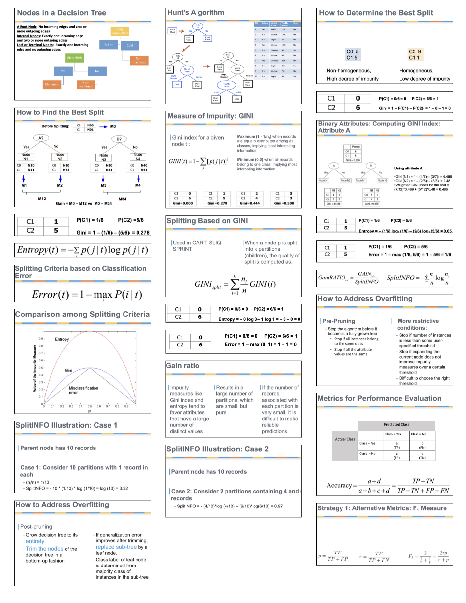

# Motivation

I created this tool because I needed a way to quickly create cheat sheets for my classes without spending time manually organizing or handwriting everything. Here's how I use it:

1. While studying slides or course material, I take screenshots of important information
2. These screenshots are automatically saved in chronological order in a folder
3. I then use this program to automatically organize these screenshots into a cheat sheet
4. The program preserves the chronological order of the screenshots
5. I can customize the layout by choosing how many pages and columns I need

This approach saves me a lot of time and effort while still creating effective study materials.

# Cheat Sheet Creator

A Python application that helps you create cheat sheets from screenshots by organizing them into a PDF with a clean, grid-based layout.



## Features

- **Automatic Layout**: Organizes screenshots into a customizable grid layout (1-6 columns)
- **Smart Sorting**: Sorts screenshots by timestamp in filename with multiple fallback methods
- **PDF Export**: Creates a clean, well-formatted PDF with up to 10 pages
- **Preview Mode**: See how your cheat sheet will look before exporting
- **Customizable**: Adjust margins, number of columns, and maximum pages
- **Command Line Support**: Run in debug mode or specify image directory
- **Error Handling**: Robust timestamp parsing and image processing with fallbacks

## Requirements

- Python 3.9+
- Required packages:
  - Pillow (for image processing)
  - reportlab (for PDF generation)
  - (No additional dependencies for basic usage)

## Installation

1. Clone this repository
2. Create a virtual environment:
   ```bash
   python -m venv venv
   source venv/bin/activate  # On Windows: venv\Scripts\activate
   ```
3. Install dependencies:
   ```bash
   pip install -r requirements.txt
   ```

## Usage

### GUI Mode
1. Run the application:
   ```bash
   python main.py
   ```
2. Use the interface to:
   - Select an images directory
   - Adjust layout settings (margins, columns, pages)
   - Preview the layout
   - Export to PDF

### Command Line Mode
Run with debug mode and specify an images directory:
```bash
python main.py --debug --images /path/to/images
```

This will automatically:
1. Load images from the specified directory
2. Display them in the GUI
3. Generate and open a preview PDF

## Layout Settings

- **Columns**: Adjustable from 1-6 columns (default: 3)
- **Pages**: Set maximum pages from 1-10 (default: 2)
- **Margins**: Adjust margins in points (default: 10pt)
- **Image Spacing**: Fixed at 10pt padding between images

## Image Requirements

- Supported formats: PNG, JPG, JPEG
- Filenames should include timestamps for proper sorting
- Example format: `Screenshot 2025-04-05 at 9.25.49 PM.png`

### Timestamp Parsing

The application will attempt to parse timestamps in this order:
1. From filename (macOS screenshot format)
2. File modification time
3. Current time (if all else fails)

## Testing

The application comes with comprehensive unit tests. These tests cover core functionality including:

- Image frame creation and management
- Timestamp parsing with multiple formats
- Directory browsing and image loading
- Layout calculations and UI updates
- PDF preview and export functionality
- Command line interface and arguments

### Running Tests

To run the test suite:

```bash
python -m unittest test_main.py
```

### Test Coverage

To run tests with coverage reporting:

```bash
# Install coverage tools
pip install coverage

# Run tests with coverage
coverage run -m unittest test_main.py

# Display coverage report
coverage report -m

# Generate HTML coverage report
coverage html
```

Current test coverage: 50% of main.py

The tests focus on core application logic. The parts not covered by tests are primarily the detailed PDF layout rendering logic, which involves complex canvas operations and is more challenging to test programmatically.

## Development

For development work, you can install the package with development dependencies:

```bash
pip install -e ".[dev]"
```

This will install additional tools like pytest and pytest-cov.

## Troubleshooting

If you encounter a "No module named 'reportlab'" error despite having installed the requirements, make sure to run the script using the Python interpreter from your virtual environment:

```bash
./venv/bin/python main.py
```

## License

This project is licensed under the MIT License - see the LICENSE file for details. 